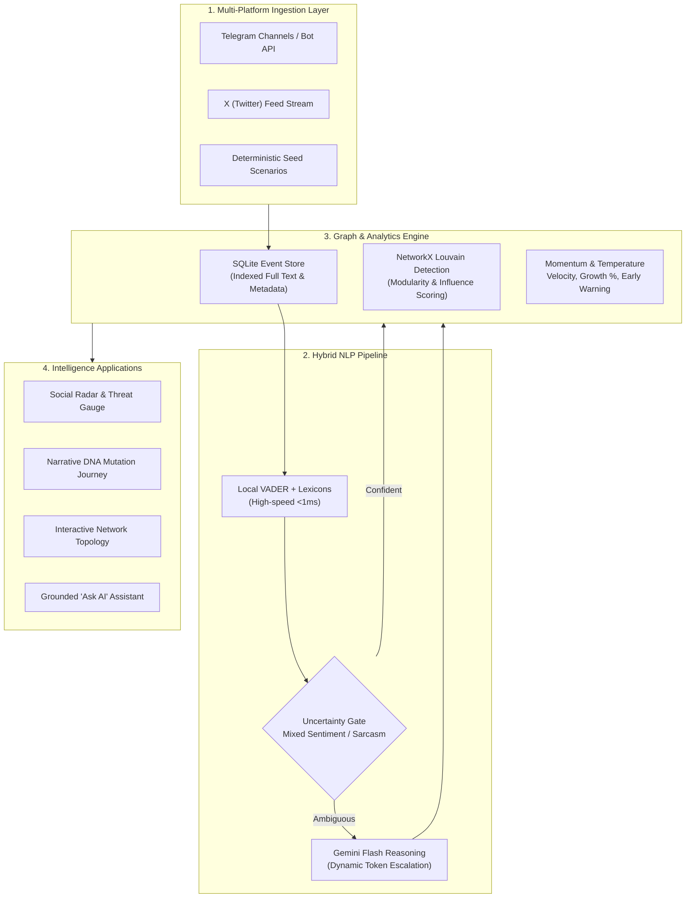

<div align="center">

# 🌐 SCIOTRACE
### Next-Gen Cognitive Social Media Intelligence & Narrative DNA Tracking System

[](https://fastapi.tiangolo.com)
[](https://react.dev)
[](https://aistudio.google.com)
[](https://networkx.org)
[](https://docs.pytest.org)
[](LICENSE)

<br/>

**SCIOTRACE** is an enterprise-grade situational awareness platform designed to trace, model, and forecast how viral narratives originate, mutate, and spread across disparate digital ecosystems. By coupling **local-first hybrid NLP**, **Louvain topological graph clustering**, and **Generative AI reasoning**, SCIOTRACE delivers actionable strategic intelligence before viral breakout occurs.

[Explore Features](#-core-capabilities) • [System Architecture](#-system-architecture) • [Quickstart](#-quickstart-guide) • [API Contracts](#-api-specification) • [Evaluation Suite](#-nlp-evaluation-framework)

</div>

---

## 🌟 Highlights

- 🧬 **Narrative DNA & Semantic Phylogeny**: Deconstructs posts into core claims, origin vectors, and cross-platform mutation journeys across online communities.
- ⚡ **Three-Tier Hybrid NLP Engine**: Local VADER + domain lexicon handles 80%+ of routine traffic in <1ms; an uncertainty gate escalates ambiguous, sarcastic, or high-risk posts to Google Gemini Flash.
- 🕸️ **Louvain Graph Topology & Role Mining**: Identifies exact actor archetypes: *Originators*, *Bridges*, *Authorities*, and *Amplifiers*.
- 🔥 **Early Signal Detection & Social Temperature**: Calculates real-time narrative velocity, cross-platform jump vectors, and breakout probability (0–100%).
- 🤖 **Grounded AI Copilot**: Fact-anchored Q&A interface that synthesizes strategic assessments with verified platform evidence, citations, and confidence scores.
- 📡 **Dual-Mode Ingestion**: Operates seamlessly on deterministic multi-platform seed scenarios or real-time live ingestion via Telegram MTProto and Bot APIs.

---

## 🏗️ System Architecture



---

## 🔬 Core Capabilities

### 1. Narrative DNA & Mutation Journey
Narratives rarely travel unmodified—they mutate to align with each community's biases. SCIOTRACE reconstructs this semantic lineage chronologically:
- **Origin Anchor**: First recorded timestamp, source author, platform vector, and core claim.
- **Mutation Stages**: Frame-by-frame transformation (e.g. how a bureaucratic policy notice shifts to consumer anger on X, student mobilization on Reddit, and financial panic on Telegram).
- **Dominant Emotion Flow**: Sequential sentiment shift mapped across community hops.

### 2. Topological Actor Role Classification
Using NetworkX and Louvain community partitioning, every participating node in a narrative network is assigned a strategic operational role:
- **Originator**: The primordial source seed of the claim.
- **Bridge**: High betweenness-centrality nodes connecting previously disconnected communities.
- **Authority**: High in-degree reference nodes providing institutional or expert credibility.
- **Amplifier**: Retweet/forward hubs responsible for high-frequency distribution.

### 3. Early Signal Detection & Social Temperature
SCIOTRACE prevents surprise breakouts by monitoring sub-threshold trends before they trend publicly:
$$\text{Social Temperature} = f(\text{Volume Growth}, \text{Cross-Platform Hops}, \text{Hostility/Anxiety Delta})$$
- Status bands: `Calm` $\rightarrow$ `Warming` $\rightarrow$ `Heated` $\rightarrow$ `Critical`
- Flags narrative candidates with `WATCH` warnings when community spread velocity exceeds 100% week-over-week.

---

## ⚡ Quickstart Guide

### Prerequisites
- **Python**: `3.10+` (tested on 3.12)
- **Node.js**: `v18+` & `npm`
- **Git**

---

### Step 1: Clone Repository
```bash
git clone https://github.com/Nimonium/SCIOTRACE.git
cd SCIOTRACE
```

---

### Step 2: Backend Setup
```bash
# Navigate to backend directory
cd backend

# Create virtual environment
python -m venv venv
source venv/bin/activate  # On Windows: .\venv\Scripts\activate

# Install dependencies
pip install -r requirements.txt

# Configure environment variables
cp .env.example .env
```

Edit `backend/.env` with your preferred configuration:
```env
# Optional: Google Gemini API Key for hybrid LLM reasoning
GEMINI_API_KEY=your_gemini_api_key_here

# Optional: Live Telegram Ingest credentials (from my.telegram.org)
TELEGRAM_API_ID=
TELEGRAM_API_HASH=
TELEGRAM_BOT_TOKEN=

# Event Store Path
SQLITE_DB_PATH=social_pulse.db
```
> **Note**: SCIOTRACE functions **100% offline out-of-the-box** using local heuristics and seed data if no external API keys are configured.

Start the FastAPI backend server:
```bash
python main.py
# Server runs on http://localhost:8000
# OpenAPI / Swagger UI: http://localhost:8000/docs
```

---

### Step 3: Frontend Setup
In a new terminal window:
```bash
cd frontened
npm install
npm run dev
# Dashboard launches on http://localhost:5173
```

---

## 🧪 Testing Suite

SCIOTRACE includes a comprehensive automated test suite ensuring end-to-end reliability across all schema validations, clustering stages, early signal detection, and API endpoints.

```bash
pytest -v
```

```text
============================= test session starts =============================
backend/test_app.py::test_health PASSED                                  [  6%]
backend/test_app.py::test_seed_ingest PASSED                             [ 13%]
backend/test_app.py::test_get_narratives PASSED                          [ 20%]
backend/test_app.py::test_get_narrative_dna PASSED                       [ 26%]
backend/test_app.py::test_get_narrative_timeline PASSED                  [ 33%]
backend/test_app.py::test_get_narrative_network PASSED                   [ 40%]
backend/test_app.py::test_get_trends PASSED                              [ 46%]
backend/test_app.py::test_get_alerts PASSED                              [ 53%]
backend/test_app.py::test_ask_endpoint PASSED                            [ 60%]
backend/test_app.py::test_get_demographics PASSED                        [ 66%]
backend/test_app.py::test_get_narrative_communities PASSED               [ 73%]
backend/test_app.py::test_ingest_event_clustering_existing_and_new PASSED [ 80%]
backend/test_app.py::test_early_signal_detection_and_alerts PASSED       [ 86%]
backend/test_app.py::test_mutation_journey_endpoint PASSED               [ 93%]
backend/test_app.py::test_social_temperature_fields PASSED               [100%]
============================= 15 passed in 6.56s ==============================
```

---

## 📡 API Specification

| Method | Endpoint | Description |
| :--- | :--- | :--- |
| `GET` | `/api/v1/health` | Service health status and uptime checks |
| `POST` | `/api/v1/ingest/seed` | Generates consistent cross-platform narrative scenario |
| `POST` | `/api/v1/ingest/event` | Ingests a single post, auto-clusters into narrative or creates new |
| `GET` | `/api/v1/narratives` | Narrative cards with momentum, temperature & breakout scores |
| `GET` | `/api/v1/narratives/{id}` | Complete Narrative DNA: origin, mutation stages, forecast |
| `GET` | `/api/v1/narratives/{id}/mutation-journey` | Chronological reframing across community hops |
| `GET` | `/api/v1/narratives/{id}/timeline` | Event volume & emotion timeline time-series |
| `GET` | `/api/v1/narratives/{id}/network` | Directed actor graph with Louvain community clusters & roles |
| `GET` | `/api/v1/narratives/{id}/communities` | Sentiment & demographic breakdown by audience cluster |
| `GET` | `/api/v1/trends` | Real-time trend momentum curves & velocity |
| `GET` | `/api/v1/alerts` | Prioritized situational warning feed (`critical`, `accelerating`, `watch`) |
| `POST` | `/api/v1/ask` | Fact-grounded generative Q&A with citations |
| `GET` | `/api/v1/demographics/{id}` | Age bracket, language, and audience tribe distributions |

---

## 📊 NLP Evaluation Framework

SCIOTRACE includes a dedicated, scientific evaluation framework under `backend/eval/`:

1. **Interactive Blind Labeler (`backend/eval/label_tool.py`)**: Terminal tool allowing human annotators to blind-label posts without model bias.
2. **Resilient Model Runner (`backend/eval/run_models.py`)**: Executes both local and LLM classifications with 3-attempt exponential backoff on API rate limits.
3. **Scoring Engine (`backend/eval/score.py`)**: Computes exact Precision, Recall, F1-Score, and Sentiment Confusion Matrices against gold-standard labels.

```bash
# Run model comparison
python backend/eval/run_models.py

# Generate accuracy scorecard & confusion matrices
python backend/eval/score.py
```

---

## 📂 Project Structure

```text
SCIOTRACE/
├── backend/
│   ├── main.py              # FastAPI application server & lifespan hooks
│   ├── db.py                # SQLite event store, schemas & migrations
│   ├── ingest.py            # Event clustering & synthetic scenario generator
│   ├── nlp.py               # Hybrid NLP: VADER, uncertainty gate & Gemini client
│   ├── graph.py             # NetworkX Louvain graph & role classifier
│   ├── trends.py            # Momentum scores, velocity & early signal detection
│   ├── narrative.py         # Narrative DNA, mutation journey & demographics
│   ├── ask_service.py       # Grounded Q&A assistant with evidence citations
│   ├── live_telegram.py     # Live Telegram ingestion via MTProto & Bot API
│   ├── test_app.py          # Deterministic 15-test verification suite
│   ├── requirements.txt     # Python backend dependencies
│   └── eval/                # Evaluation & benchmark framework
│       ├── label_sheet.csv  # Ground truth benchmark dataset
│       ├── label_tool.py    # Blind annotation CLI tool
│       ├── run_models.py    # Model execution with 503 retry resilience
│       └── score.py         # Statistical evaluation & confusion matrix generator
├── frontened/
│   ├── src/
│   │   ├── screens/         # Social Radar, Narrative DNA, Graph, Ask AI, Settings
│   │   ├── components/      # Glassmorphic UI cards, gauges, charts, navigation
│   │   └── api/             # Typed API client connecting to backend
│   ├── package.json         # React & frontend dependencies
│   └── vite.config.js       # Vite bundler configuration
└── README.md                # Project documentation
```

---

## 🔐 Security & Ethical Data Governance

- **Zero Data Leakage**: Sensitive credentials (`.env`, database files, bot tokens) are strictly excluded from version control via `.gitignore`.
- **Local-First Architecture**: Baseline sentiment analysis, entity extraction, and graph clustering operate entirely on-premise without transmitting unflagged raw text to third-party APIs.
- **Auditability**: All generative summaries generated by the AI Copilot are linked to concrete source event IDs stored in the audit trail.

---

## 📄 License

Distributed under the **MIT License**. See `LICENSE` for more information.

<div align="center">
<b>SCIOTRACE</b> — Turning social media chaos into actionable strategic clarity.
</div>
